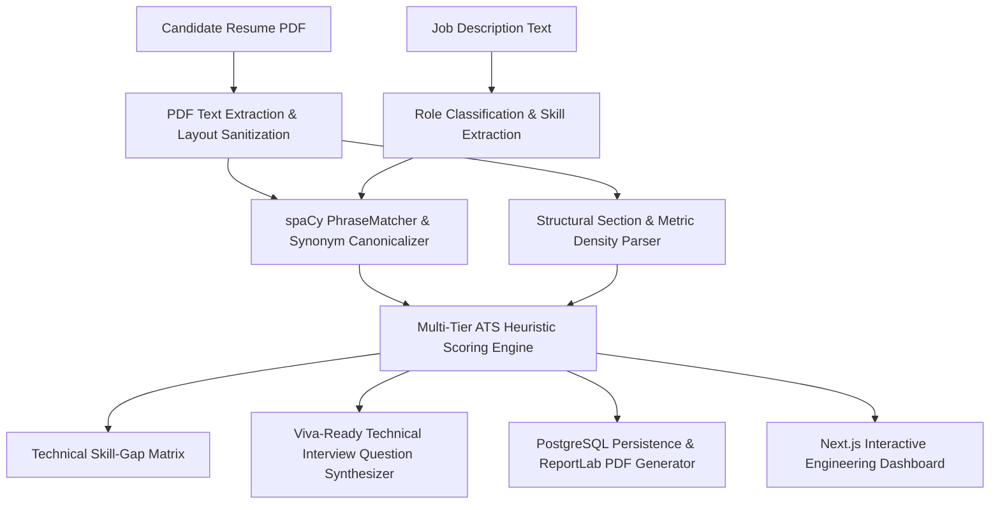

# Final-Year Computer Engineering Project Roadmap: AI Resume Analyzer

This document outlines the technical design, engineering principles, and academic justification for advancing the **AI Resume Analyzer** as a Computer Engineering final-year capstone project.

---

## 1. Academic & Engineering Architecture Overview

Every feature in the system is designed to be **deterministic, explainable, and viva-defensible**, avoiding opaque third-party LLM APIs while providing robust NLP and software engineering metrics.

---

## 2. Priority Enhancements Breakdown

### Feature 6: Advanced NLP Matching & Lemmatization
- **Technical Purpose**: Expand token matching beyond exact strings using token lemmatization, canonical alias taxonomies, and multi-word phrase extraction with spaCy.
- **Viva Explanation**: Explains how NLP preprocessing (stop-word pruning, lowercasing, punctuation stripping, lemma reduction, and phrase matching) resolves variations like *"Postgres"* $\rightarrow$ *"PostgreSQL"*, *"k8s"* $\rightarrow$ *"Kubernetes"*, or *"TDD"* $\rightarrow$ *"Unit Testing"*.

---

### Feature 7: Role-Specific Benchmark Analysis
- **Technical Purpose**: Automatically classify the target position into standard engineering archetypes:
  - *Backend Engineering* (FastAPI, Django, PostgreSQL, Redis, Microservices)
  - *Frontend Engineering* (React, Next.js, TypeScript, Tailwind, CSS)
  - *DevOps & Cloud Infrastructure* (Docker, Kubernetes, CI/CD, Terraform, AWS)
  - *Data Science & Machine Learning* (PyTorch, TensorFlow, Pandas, NLP, Scikit-Learn)
- **Viva Explanation**: Implements domain-specific benchmark scoring where missing a primary role competency (e.g. SQL for backend or Docker for DevOps) applies a proportional penalty rather than a generic flat deduction.

---

### Feature 8: Deep Structural & Metric Section Analysis
- **Technical Purpose**: Perform an audit on resume content quality:
  - **Action Verb Density**: Identifies strong engineering action verbs (*architected*, *implemented*, *streamlined*, *optimized*, *refactored* vs passive phrases).
  - **Quantifiable Impact Ratio**: Computes the percentage of bullet points containing quantifiable metrics ($\%, \$, \text{ms}, \times, \text{users}$).
  - **Section Completeness**: Measures structure across Summary, Experience, Education, Projects, and Skills.
- **Viva Explanation**: Demonstrates how real ATS parsers evaluate resume readability and signal strength beyond raw keyword stuffing.

---

### Feature 9: Rule-Based Technical Interview Question Generator
- **Technical Purpose**: Synthesize targeted, context-aware interview questions based directly on the candidate's extracted skills, projects, and identified skill gaps.
- **Implementation Strategy**:
  - For **Matched Skills**: Generates deep conceptual & scenario questions (e.g., *"How do you handle connection pooling with PostgreSQL in a serverless environment?"*).
  - For **Missing Skills**: Generates transition/adaptability questions (e.g., *"The job requires Docker and Kubernetes; how would you containerize your existing FastAPI services?"*).
- **Viva Explanation**: Uses rule-based domain ontology graphs to generate consistent, deterministic questions without unpredictable LLM hallucinations or API latency.

---

## 3. Implementation Status Summary

| # | Feature | Status | Engineering Focus |
|---|---|:---:|---|
| **1** | **Professional Dashboard** | **Completed** | Next.js 14 App Router, Tailwind CSS, clean dark theme |
| **2** | **ATS Score Visualisation** | **Completed** | 0–100 dial, 4-tier dimensional cards, progress bars |
| **3** | **Skill-Gap Analysis** | **Completed** | Matched vs missing skills with taxonomy normalization |
| **4** | **Analysis History** | **Completed** | PostgreSQL persistence, UUID keys, click-to-load history |
| **5** | **Professional PDF Report** | **Completed** | In-memory ReportLab PDF generator with print styling |
| **6** | **Enhanced NLP Matching** | *Ready to implement* | Expanded skill ontology, fuzzy token matching |
| **7** | **Role-Specific Benchmarks** | *Ready to implement* | Automatic role classification & archetype weighting |
| **8** | **Deep Section & Metric Audit**| *Ready to implement* | Action verb detector, quantified metric percentage |
| **9** | **Interview Question Synthesizer**| *Ready to implement* | Deterministic domain-driven interview question generator |
